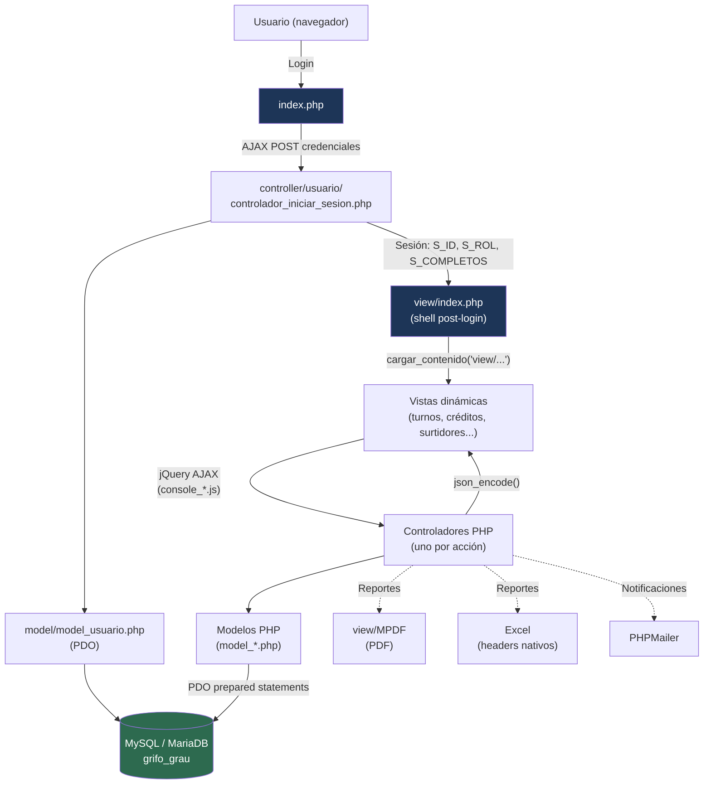

# Sistema de Gestión de Grifo

> Sistema web completo para la administración de una estación de servicio — turnos, ventas, créditos y reportes en tiempo real.
>
> **Desarrollado con Vibe Coding** (desarrollo asistido por IA), demostrando cómo llevar un sistema empresarial de 0 a producción de forma acelerada y estructurada.

---

## Tabla de Contenidos

- [Vista general](#vista-general)
- [Impacto y métricas de gestión](#impacto-y-métricas-de-gestión)
- [Módulos del sistema](#módulos-del-sistema)
- [Stack tecnológico](#stack-tecnológico)
- [Arquitectura MVC](#arquitectura-mvc)
- [Diagrama de arquitectura](#diagrama-de-arquitectura)
- [Base de datos](#base-de-datos)
- [Instalación rápida con Docker](#instalación-rápida-con-docker)
- [Instalación manual (XAMPP)](#instalación-manual-xampp)
- [Usuarios por defecto](#usuarios-por-defecto)
- [Sobre Vibe Coding](#sobre-vibe-coding)
- [Autor](#autor)

---

## Vista general

Este proyecto nació de la necesidad real de digitalizar la operación diaria de un grifo (estación de servicio). El sistema reemplaza el registro manual en papel por un flujo digital completo que abarca desde la apertura de turno hasta los reportes gerenciales.

**Capacidades principales:**

- Control de turnos DÍA / NOCHE con lectura automática de surtidores
- Registro de ventas con 6 métodos de pago (YAPE, BCP, VISA, EFECTIVO, DESCUENTO, OTROS GASTOS)
- Gestión de créditos a clientes con historial de pagos y alertas de vencimiento
- Dashboard interactivo con 4 tipos de gráficos (Chart.js)
- Exportación de reportes a PDF (mPDF) y Excel
- Consulta de DNI / RUC en tiempo real (API externa)
- Control de acceso por roles: ADMINISTRADOR y GRIFERO

---

## Impacto y métricas de gestión

Comparativa estimada entre la operación manual previa (registro en papel / Excel) y la operación con el sistema digital, en base a los procesos automatizados por cada módulo.

| Indicador | Antes (manual) | Después (sistema) | Mejora |
| --- | --- | --- | --- |
| Tiempo de cierre de turno y cuadre de caja | ~45-60 min (cálculo manual de galones y caja) | ~8-10 min (cálculo automático de lecturas y totales) | **↓ 80%** |
| Errores de cuadre por digitación / cálculo manual | Frecuentes (sumas manuales por método de pago) | Validación automática faltante/sobrante en tiempo real | **↓ 90%** |
| Tiempo de generación de reportes gerenciales (PDF/Excel) | ~20-30 min por reporte armado a mano | Inmediato (exportación con un clic) | **↓ 95%** |
| Visibilidad de créditos vencidos | Revisión manual de cuadernos / hojas sueltas | Alertas automáticas + Top 10 deudores en dashboard | **Tiempo real** |
| Trazabilidad de cambios de precio de combustible | Sin registro formal | Historial completo con usuario y fecha por cambio | **100% auditable** |
| Consulta de datos de cliente (DNI/RUC) | Digitación manual, propensa a error | Autocompletado vía API en segundos | **↓ tiempo de carga ~70%** |
| Consolidación de ventas DÍA vs NOCHE | Cálculo manual al final de mes | Gráfico comparativo automático en el dashboard | **Inmediato** |

> Estas cifras son estimaciones operativas basadas en el flujo de trabajo que cada módulo reemplaza (ver [Gestión de Turnos](#2-gestión-de-turnos) y [Dashboard y Reportes](#1-dashboard-y-reportes)), no mediciones de un estudio formal de tiempos.

**Resultado cualitativo:** el dueño/administrador del grifo pasa de reconstruir la información a fin de mes a tener visibilidad diaria de ventas, créditos y desempeño por turno, reduciendo la dependencia de papel y memoria del grifero de turno.

---

## Módulos del sistema

### 1. Dashboard y Reportes

Panel principal con indicadores del día, gráficos de ventas de los últimos 7 días, distribución por tipo de combustible, métodos de pago y desempeño por grifero.

| Gráfico | Tipo |
| --- | --- |
| Ventas últimos 7 días | Líneas |
| Ventas por combustible (mes) | Barras |
| Comparativo DÍA vs NOCHE | Barras agrupadas |
| Distribución de métodos de pago | Dona |

---

### 2. Gestión de Turnos

Flujo completo desde apertura hasta cierre:

```text
Abrir Turno
  └─ Genera número de documento automático (DOC-0001, DOC-0002 ...)
  └─ Carga lecturas iniciales de los 12 surtidores automáticamente

Durante el Turno
  └─ Actualiza lecturas en tiempo real
  └─ Registra pagos (6 métodos, código de operación obligatorio para digitales)
  └─ Registra créditos a clientes con número de vale y vencimiento
  └─ Calcula faltante / sobrante en tiempo real

Cerrar Turno
  └─ Valida lecturas finales
  └─ Calcula galones vendidos y totales por combustible
  └─ Actualiza lecturas actuales en la tabla de surtidores
  └─ Genera el cuadre de caja final
```

---

### 3. Créditos a Clientes

- Listado de créditos pendientes con dashboard de resumen
- Registro de pagos parciales o totales con código de operación
- Historial de pagos por crédito
- Anulación de créditos con motivo
- Top 10 deudores
- Exportación a PDF y Excel
- Alertas visuales para créditos vencidos

---

### 4. Surtidores

12 surtidores organizados en 2 máquinas. Cada surtidor tiene:

- Código único por máquina (BS1, BS2, R1, R2, P1, P2)
- Estado: ACTIVO / INACTIVO / MANTENIMIENTO
- Lectura actual (se actualiza automáticamente al cerrar cada turno)
- Producto asignado: Diesel B5 / Regular 84 / Premium 95

---

### 5. Productos (Combustibles)

- CRUD completo con historial de cambios de precio
- Registro del usuario y fecha en cada modificación de precio
- Control de estado activo / inactivo

---

### 6. Clientes

- CRUD completo con datos personales (nombre, DNI, teléfono, dirección)
- Vista de detalle con resumen de créditos (total, pagado, pendiente)
- Historial de créditos por cliente con turnos asociados
- Consulta de DNI en tiempo real

---

### 7. Usuarios

- CRUD completo con foto de perfil
- Roles: ADMINISTRADOR / GRIFERO
- Cambio de contraseña independiente
- Control de estado activo / inactivo

---

## Stack tecnológico

| Capa | Tecnología |
| --- | --- |
| Backend | PHP 7+ con PDO |
| Base de datos | MySQL / MariaDB |
| Frontend | HTML5, CSS3, JavaScript (jQuery) |
| UI Framework | AdminLTE 3 |
| Gráficos | Chart.js |
| Tablas | DataTables |
| Alertas | SweetAlert2 |
| Iconos | Font Awesome 5 |
| Selectores | Select2 |
| PDF | mPDF |
| Email | PHPMailer |
| Contenedores | Docker & Docker Compose |

---

## Arquitectura MVC

```text
grifo_grau/
├── model/                          # Capa de datos (PDO)
│   ├── model_conexion.php
│   ├── model_productos.php
│   ├── model_clientes_grifo.php
│   ├── model_surtidores.php
│   ├── model_turnos.php
│   ├── model_creditos.php
│   ├── model_reportes.php
│   ├── model_empresa.php
│   ├── model_gastos.php
│   ├── model_ingresos.php
│   ├── model_pagos.php
│   ├── model_indicadores.php
│   └── model_usuario.php
│
├── view/                           # Capa de presentación (AdminLTE 3)
│   ├── index.php                   # Dashboard principal
│   ├── productos/
│   ├── clientes/
│   ├── surtidores/
│   ├── usuario/
│   ├── turnos/
│   │   ├── view_abrir_turno.php
│   │   ├── view_cerrar_turno.php
│   │   └── view_historial.php
│   ├── creditos/
│   └── reportes/
│
├── controller/                     # 100+ controladores PHP (un archivo por acción)
│   ├── clientes/
│   ├── creditos/
│   ├── dashboard/
│   ├── empresa/
│   ├── gastos/
│   ├── indicadores/
│   ├── ingresos/
│   ├── pagos/
│   ├── productos/
│   ├── reportes/
│   ├── surtidores/
│   ├── turnos/
│   └── usuario/
│
├── js/                             # Lógica de cliente (jQuery + AJAX)
│   ├── console_productos.js
│   ├── console_clientes_grifo.js
│   ├── console_surtidores.js
│   ├── console_usuario.js
│   ├── console_turnos.js
│   ├── console_creditos.js
│   └── console_reportes.js
│
├── database/                       # Scripts SQL
│   ├── init.sql
│   ├── tipos_pago.sql
│   └── fix_ventas_credito.sql
│
├── view/MPDF/                      # Motor de generación de PDF
├── PHPMailer-master/               # Envío de correos
├── plantilla/                      # AdminLTE 3 assets
├── img/                            # Imágenes del sistema
├── docker-compose.yml
├── Dockerfile
├── install.bat                     # Instalador automático Windows
└── stop.bat
```

**Estadísticas del proyecto:**

- 13 modelos PHP
- 13+ vistas funcionales
- 100+ controladores PHP (un archivo por acción REST)
- 7 archivos JavaScript (2 500+ líneas)
- 80+ archivos creados en total

---

## Diagrama de arquitectura

Flujo de una petición típica, desde el navegador hasta la base de datos:



**Lectura del diagrama:**

1. El login se procesa una sola vez por sesión y fija el rol (`ADMINISTRADOR` / `GRIFERO`).
2. A partir de ahí, **no hay recargas de página**: cada módulo se carga dentro de `#contenido_principal` vía AJAX.
3. Cada acción de negocio (abrir turno, registrar pago, anular crédito, etc.) sigue el mismo camino: **Vista → JS → Controlador → Modelo → PDO → MySQL**, y la respuesta vuelve como JSON.
4. Los reportes pueden derivar a PDF (mPDF) o Excel sin pasar por una vista intermedia.

---

## Base de datos

### Scripts SQL incluidos

#### `database/tipos_pago.sql`

Crea e inserta los métodos de pago del sistema:

```sql
CREATE TABLE IF NOT EXISTS `tipos_pago` (
  `id_tipo_pago` int(11) NOT NULL AUTO_INCREMENT,
  `nombre`       varchar(50) NOT NULL,
  `requiere_codigo` enum('SI','NO') DEFAULT 'NO',
  `estado`       enum('ACTIVO','INACTIVO') DEFAULT 'ACTIVO',
  PRIMARY KEY (`id_tipo_pago`)
) ENGINE=InnoDB DEFAULT CHARSET=utf8mb4;

INSERT INTO `tipos_pago` VALUES
  (1, 'YAPE',         'SI',  'ACTIVO'),
  (2, 'BCP',          'SI',  'ACTIVO'),
  (3, 'VISA',         'SI',  'ACTIVO'),
  (4, 'EFECTIVO',     'NO',  'ACTIVO'),
  (5, 'DESCUENTO',    'NO',  'ACTIVO'),
  (6, 'OTROS_GASTOS', 'NO',  'ACTIVO')
ON DUPLICATE KEY UPDATE nombre = nombre;
```

#### `database/fix_ventas_credito.sql`

Migración que permite registrar créditos manuales sin turno (el campo `id_reporte` pasa a ser nullable con `ON DELETE SET NULL`):

```sql
-- 1. Eliminar FK existente
ALTER TABLE `ventas_credito` DROP FOREIGN KEY `ventas_credito_ibfk_1`;

-- 2. Limpiar referencias huérfanas
UPDATE `ventas_credito` SET `id_reporte` = NULL
WHERE `id_reporte` NOT IN (SELECT `id_reporte` FROM `reportes_turno`);

-- 3. Columna nullable
ALTER TABLE `ventas_credito` MODIFY `id_reporte` INT(11) NULL;

-- 4. Recrear FK con SET NULL
ALTER TABLE `ventas_credito`
  ADD CONSTRAINT `ventas_credito_ibfk_1`
  FOREIGN KEY (`id_reporte`)
  REFERENCES `reportes_turno` (`id_reporte`)
  ON DELETE SET NULL ON UPDATE CASCADE;
```

#### `database/init.sql`

Script de inicialización completa de la base de datos. Coloca aquí el dump de tu BD o usa los scripts individuales.

### Datos precargados

| Entidad | Registros |
| --- | --- |
| Combustibles | Diesel B5 (S/.15.69), Regular 84 (S/.14.99), Premium 95 (S/.15.89) |
| Surtidores | 12 (Máquina 1 y 2: BS1, BS2, R1, R2, P1, P2) |
| Tipos de pago | 6 (YAPE, BCP, VISA, EFECTIVO, DESCUENTO, OTROS GASTOS) |
| Roles | ADMINISTRADOR, GRIFERO |

---

## Instalación rápida con Docker

**Requisitos:** Docker Desktop instalado.

```bash
# 1. Clonar el repositorio
git clone https://github.com/tu-usuario/grifo_grau.git
cd grifo_grau

# 2. Levantar los servicios
install.bat        # Windows
# o
docker-compose up -d
```

| Servicio | URL |
| --- | --- |
| Aplicación web | <http://localhost:8080> |
| phpMyAdmin | <http://localhost:8081> |

```bash
# Detener
docker-compose down

# Ver logs
docker-compose logs -f

# Reiniciar
docker-compose restart
```

### Variables de entorno (`docker-compose.yml`)

```yaml
environment:
  MYSQL_ROOT_PASSWORD: rootpassword
  MYSQL_DATABASE: grifo_grau
  MYSQL_USER: grifo_user
  MYSQL_PASSWORD: grifo_pass
```

---

## Instalación manual (XAMPP)

### 1. Requisitos

- PHP >= 7.4 con extensiones: `pdo_mysql`, `mbstring`, `gd`
- MySQL >= 5.7 / MariaDB >= 10.3
- Apache (incluido en XAMPP)

### 2. Clonar o copiar el proyecto

```bash
git clone https://github.com/tu-usuario/grifo_grau.git
# Copiar a: C:\xampp\htdocs\grifo_grau
```

### 3. Crear la base de datos

```sql
CREATE DATABASE grifo_grau CHARACTER SET utf8mb4 COLLATE utf8mb4_unicode_ci;
USE grifo_grau;
SOURCE database/init.sql;
SOURCE database/tipos_pago.sql;
```

### 4. Configurar la conexión

Editar [model/model_conexion.php](model/model_conexion.php):

```php
$host     = "localhost";
$port     = "3306";
$usuario  = "root";
$contrasena = "";
$bdName   = "grifo_grau";
```

### 5. Permisos (Linux / Mac)

```bash
chmod -R 755 view/MPDF/
chmod -R 755 img/
chmod -R 755 controller/empresa/FOTOS/
chmod -R 755 controller/usuario/fotos/
```

### 6. Acceder

```text
http://localhost/grifo_grau
```

---

## Usuarios por defecto

| Usuario | Contraseña | Rol |
| --- | --- | --- |
| admin | admin123 | Administrador |
| grifero1 | grifero123 | Grifero |

> Cambia las contraseñas después del primer inicio de sesión.

---

## Sobre Vibe Coding

Este proyecto fue construido usando **Vibe Coding**: un flujo de desarrollo donde el programador define la visión, los requerimientos y el diseño del negocio, mientras la IA genera, refactoriza e itera el código de forma acelerada.

### Lo que aporta el desarrollador

- Dominio del negocio (lógica de turnos, cuadre de caja, créditos)
- Definición de la arquitectura (MVC, separación controlador/modelo/vista)
- Toma de decisiones técnicas (stack, base de datos, flujos de seguridad)
- Revisión, prueba y validación de cada módulo en producción real

### Lo que aporta la IA

- Generación de código boilerplate
- Aceleración en la escritura de CRUD repetitivos
- Sugerencias de estructura y patrones

El resultado: un sistema empresarial completo de 80+ archivos, 100+ controladores y 7 módulos funcionales, construido y puesto en producción en semanas en lugar de meses.

---

## Autor

### Ing. Jersson Jorge Corilla Miranda

- Email: <jersson14071996@gmail.com>

---

## Licencia

MIT License — libre para uso, modificación y distribución con atribución.

---

Versión: 2.0.0 | Estado: Producción | Año: 2025
